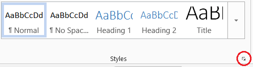

### Create the style reference docx 

You can control the formatting of the Word document by specifying a style reference. First, create the style reference document. 

- Save and Knit the current report Rmd file. 
- Save the Word document in the report directory using a new file name, e.g., *mystyles-01.docx* 

Now edit the Word styles you find there. For example, suppose we want to change the style of the report title. 

- Select the Home ribbon tab, Styles group, click the Styles window launcher (in the lower right corner of the group). 

 


- Select the report title text ("Calibration report") 
- In the Styles window, scroll down until you find the style already assigned to the selected text. 

In this case, the assigned style is *Title*. 

- Reformat the title to Palatino Linotype, italic, not bold, and change the color to black (though you may assign any settings you like). 
- In the Styles window, click on the Title style drop-down menu and select *Update to match selection*. 
- Save and close the file

Caution. You may reformat assigned styles only. Neither add new styles, change a style name, nor assign styles different from the rendered defaults. 


### Edit the YAML header 

Returning to the Rmd file, 

- Edit the YAML header as follows. 
- Save and Knit. 

```
---
title:  Calibration report
author: your name
date:   date
output:
  word_document:
    reference_docx: mystyles-01.docx
---
```


### Edit styles   


The new Word document that appears should have the reformatted title. In the Word document: 

Format your name. 

- Just under the title, select your name. Change to Palatino Linotype, 11 pt, left-aligned, 1.15 line spacing, spacing 0 pt after paragraph. 
- In the Styles window, find the assigned style (*Author*) and click *Update to match selection* 
- Save As *mystyles-01.docx* and overwrite the existing file. 

To confirm that the reference has been correctly applied, return to the Rmd file at any time, Knit Word, and the new Word document that appears should reflect the new styles. 

Format the date. 

- Just under your name, select your date. Change to Palatino Linotype, 11 pt, left-aligned, 1.15 line spacing. 
- In the Styles window, find the assigned style (*Date*) and click *Update  to match selection* 
- Save 

Format the heading. 

- Select the Introduction heading. Change to Palatino Linotype, 14 pt, italic, not bold, black, left-aligned, 1.15 line spacing. 
- In the Styles window, find the assigned style (*Heading 2*) and click *Update to match selection* 
- Save 

Format the text.

- Select the second paragraph. Change to Palationo Linotype, 11 pt, left-aligned, 1.15 line spacing. 
- In the Styles window, find the assigned style (*Body Text*) and click *Update to match selection* 
- Save 

Format the image caption.

- Select the image caption. Change to Calibri, 11 pt, not italic, left-aligned, 1.15 line spacing. 
- In the Styles window, find the assigned style (*Image Caption*) and click *Update to match selection* 
- Save 

When you are finished formatting, 

- Save and close the *mystyles.docx* 
- Save and Knit the Rnmd file 
- Review the new Word document that appears and check that your style changes have been correctly applied. 

The reports directory should look like this. 

```
reports\
  |-- load-cell-setup.png
  |-- load-cell-calibr-report.Rmd 
  |-- load-cell-calibr-report.docx
  \-- mystyles-01.docx
```


--- 
Now go to the page to [set up knitr and readr](07-setup-knitr-and-readr.html)


