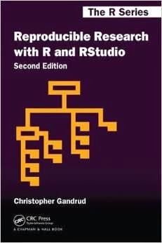

### description 

We explore the principles and practices of reproducible research, from gathering data to analyzing data and presenting results. Students implement a  workflow that includes file management, version control, literate programming, data carpentry, creating tables and graphs, and reporting---all within the context of producing reproducible technical reports. 

The software environment is R & RStudio---no prior experience required. The course is open to all majors---no background in mechanical engineering is required. 

4R-0L-4C (4 hours lecture/week, 0 lab, 4 credit hours)

### prerequisites

497: Junior standing    
597: Instructor permission required. Graduate students only with a project underway generating quantitative data.    

### instructor

Richard Layton    
Moench Hall C-217    
812-877-8905    
layton@rose-hulman.edu    

Drop in any time. If I'm engaged, please knock and let me know you are waiting. If I miss you, please email an appointment request.

### required textbook

Christopher Gandrud, 2015, *Reproducible Research with R and RStudio, 2/e*, CRC Press.    

    

 Recommended references 

If you want to buy just one book to help you learn R, I recommend  

- Robert I. Kabacoff, 2015, [*R in Action, 2/e*](https://www.manning.com/books/r-in-action-second-edition), Manning Publications.  

If you want to have a reference for all of the core R graphics systems, I recommend   

- Paul Murrell, 2011, [*R Graphics, 2/e*](https://www.crcpress.com/R-Graphics-Second-Edition/Murrell/p/book/9781439831762), CRC Press. 

Online references 

- http://rmarkdown.rstudio.com/ for R Markdown
- http://yihui.name/knitr/options/ for `knitr` options  

### objectives

After successfully completing this course, students should be able to:

- Identify non-reproducible practices in a conventional workflow 
- Describe the problems that reproducibility helps solve 
- List the basic principles of reproducible research 
- Organize directories and files for reproducibility 
- Create reproducible reports using R and RStudio 
- Reproduce someone else's reproducible project 
- Use GitHub for version control 
 
### grades

The four major deliverables and their weights are: 

- (10%) Recreating the calibration report example 
- (25%) Recreating one's own report (prior work) in reproducible form 
- (40%) Major term project in data gathering, analysis, and reporting 
- (25%) Reproducing someone else's project and critiquing the work 

Grades awarded are based on the Institute [standards](www.rose-hulman.edu/offices-services/registrar/rules-procedures/grades.aspx), for example, an "A" is an *honor grade*, a "B" is awarded for *thorough competence*, and a "C" indicates that *minimum standards have been met*.

### academic accommodations

I understand that "invisible" disabilities (learning and attention deficit disorders, chronic fatigue syndrome, clinical depression, etc.) can significantly affect a student's academic performance.  I strongly encourage students to document special academic needs with staff at the Office of Student Affairs, and then to contact me as soon as possible so that we can work together to provide recommended academic accommodations while protecting your privacy.  It is the student's responsibility to request any approved, documented academic accommodations at least *one week* in advance of the event. 

### academic integrity

Do your own work. Write your own scripts. Every draft and every revision reflects your thinking.  

Collaboration is still encouraged. Doing your own work does not mean that you work in isolation.

- An ethical author can *discuss ideas* with others. An ethical author does not have to be a lone genius working in isolation. 
- An ethical author can use code fragments or design ideas from *credible external sources* such as R blogs, books, or class materials. The R community provides abundant help. 
- An ethical author can teach others and learn from others. Help a classmate debug their code, but *view their code only*. 

Avoid peer-to-peer plagiarism. Teaching and learning are not the same as showing and copying. 

Do not compare one another's code line by line, do not share your files, do not copy another's code fragments, and do not represent someone else's work as your own. All are academic misconduct.

``Rose-Hulman expects its students to be responsible adults and to behave at all times with honor and integrity.'' (RHIT Academic Rules and Procedures.)  It is my policy to follow the letter and intent of the Rules and Procedures regarding academic misconduct.    

### caveat

I reserve the right to modify the course content, schedule, policies, etc. outlined in this syllabus. I will do my best to give you adequate notice of revisions.  

