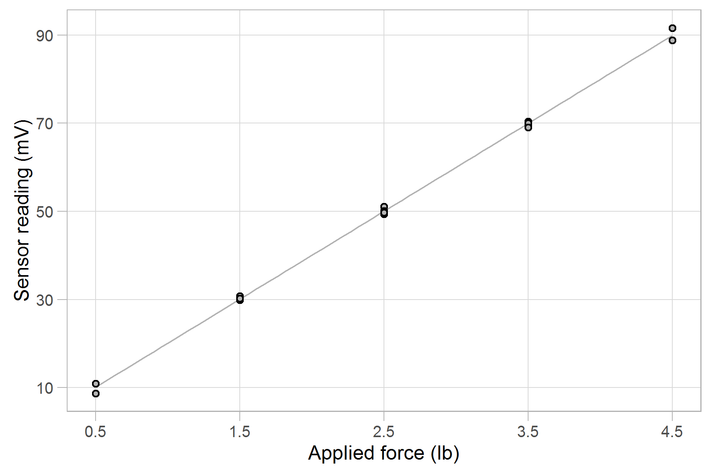

```{r 05-01, include = FALSE}
library(knitr)
opts_knit$set(root.dir = '../')
opts_chunk$set(echo = FALSE)
```

```{r 05-02}
library(plyr)
suppressPackageStartupMessages(library(dplyr))
library(readr)
```

```{r 05-03}
# sensor characteristics (hard-coded) 
sensor_model <- "Omega LCL-005"
force_max    <- 5
force_unit   <- "lb"

# itemized results that are cited in the report 
results_df <- read_csv('results/04_calibr_outcomes.csv')

# specific numbers are easier to extract from a list
results_list <- dlply(results_df, 'item')

# extract values and units
slope       <- results_list$slope$num 
intercept   <- results_list$intercept$num  
accuracy    <- results_list$accuracy$num 
resid_bound <- results_list$resid_bound$num  
input_min   <- results_list$input_min$num  
input_max   <- results_list$input_max$num 
output_min  <- results_list$output_min$num 
output_max  <- results_list$output_max$num  

# extract units
input_unit  <- results_list$input_min$unit 
output_unit <- results_list$output_min$unit 

# compute range and span
output_span <- output_max - output_min
input_range_fraction <- round(input_max / force_max * 100, 1)

# check that data are consistent with (hard-coded) sensor upper limit 
stopifnot(input_max <= force_max, input_max >= 0.9 * force_max)
stopifnot(input_range_fraction >= 90, input_range_fraction <= 100)
```

# Introduction

The goal of this analysis is to determine the calibration equation and sensor accuracy for an `r sensor_model` (0--`r force_max` `r force_unit`) load cell. 

The test setup is illustrated in Figure 1. Precision weights (0.1% accuracy) are used to apply the reference force (`r input_unit`) to the load cell and the resulting voltage readings (`r output_unit`) from the sensor are recorded. The test procedure follows the ANSI/ISA standard [@ansi-isa-1995].

```{r 05-04, fig.cap = 'Figure 1. Load cell calibration test setup'}
knitr::include_graphics("../resources/load-cell-setup-786x989px.png")
```

# Data

The calibration data are shown in Table 1. The maximum force (`r input_max` `r input_unit`) is `r input_range_fraction`% of the `r force_max` `r force_unit`  sensor limit, per the ANSI/ISA standard. The NA entries in the first and last columns are artifacts of the ANSI/ISA test procedure (the test starts and stops at a mid-range test point in the same direction). 

##### page break

```{r 05-05}
# tabulated data we saved earlier
tabulated_data <- read_csv('results/01_calibr_data-wide.csv')
kable(tabulated_data, caption = "Table 1. Calibration data")
```

# Results

The calibration data and calibration curve are shown in Figure 2. The maximum $\pm$ deviations of the data from the best-fit curve (residuals) are the values used to estimate sensor accuracy. 

```{r 05-06, fig.cap = 'Figure 2. Load cell calibration curve'}

```

##### page break

The calibration equation is
$$
y = `r sprintf("%.3f", slope)`  x + `r sprintf("%.3f", intercept)`
$$
with *x* in `r input_unit` and *y* in `r output_unit`.

The largest residual is `r sprintf("%.1f", resid_bound)` `r output_unit` and the output span is `r sprintf("%.1f", output_span)` `r output_unit`, yielding a sensor accuracy as a percent of reading of 
$$
\pm `r sprintf("%.1f", accuracy)`\%. 
$$
The accuracy of the precision weights, 0.1%, is less than one tenth the load cell accuracy, thereby meeting the requirements of the ANSI/ISA standard.  

# References

