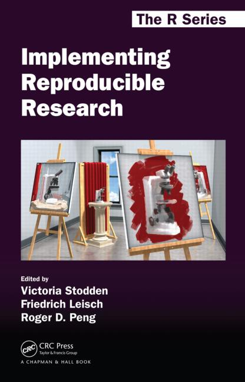
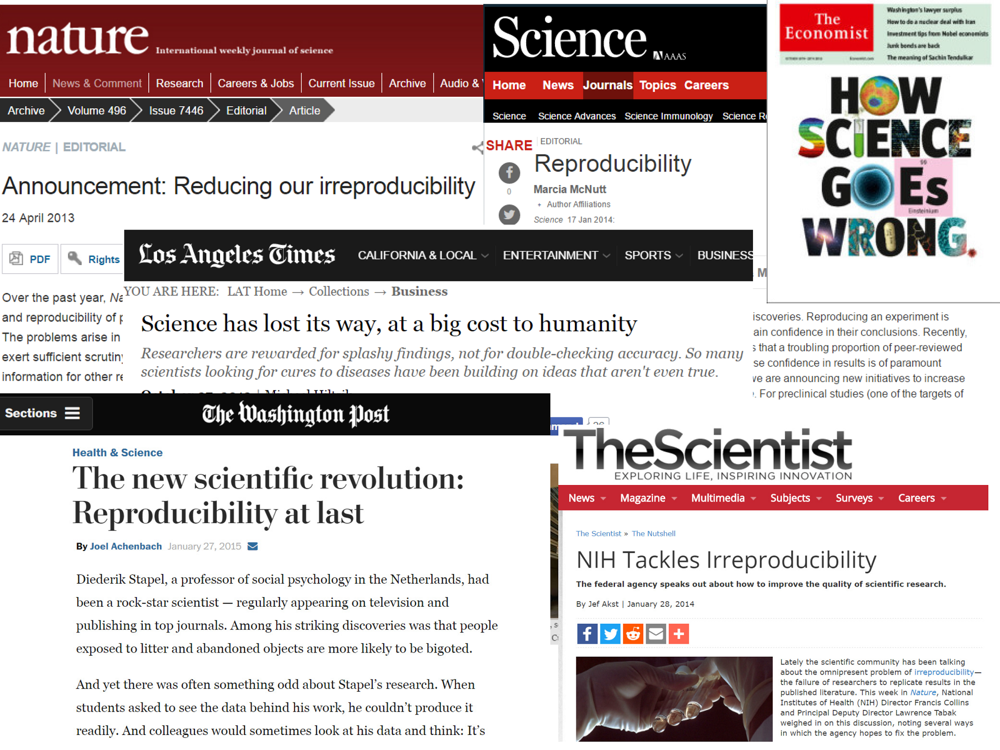
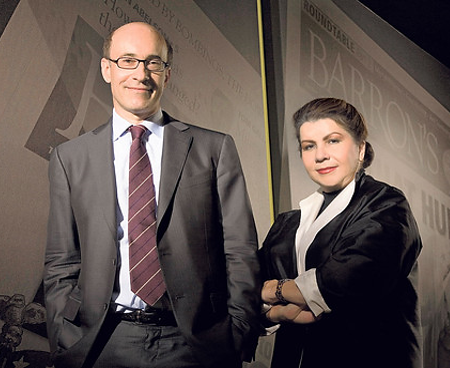
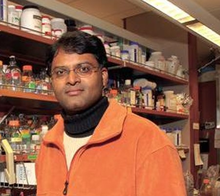
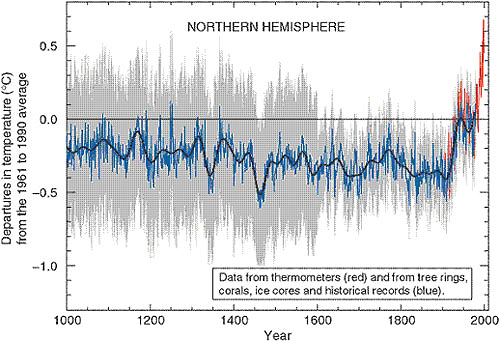

---
output:
  revealjs::revealjs_presentation:
    css: my_simple.css
    transition: fade
    center: false
    reveal_options:
      slideNumber: true
      width: 1200
---

##  Reproducible research
<!-- custom title page -->

An introduction for the R novice

 

Welcome!

 
 
Richard Layton

<footnotesize>
Department of Mechanical Engineering  
Rose-Hulman Institute of Technology  
Fall 2016  
</footnotesize>
 

## Welcome

 Trying to practice what I preach, course materials are reproducible. 

 https://dsr-rhit.github.io/me497-reproducible-research/ 

  

## Getting started

 Introductions  
Handouts

 Write down your ideas in response to Mystery question 1: 

 

*What is reproducible research?*

## Practitioners tell us:

 

  

 

Research is reproducible when the data and the code used to obtain a finding are available and sufficient for an independent researcher to recreate the finding.

 

- computational, data-intensive

- spans the full data, analysis, & publication workflow

- most of us have received only perfunctory training (if any) 

 
<footnotesize>
Victoria Stodden, F. Leisch, & R. Peng, ed., *Implementing Reproducible Research*, CRC Press, 2014.  
Christopher Gandrud, *Reproducible Research with R and RStudio, 2/e*, CRC Press, 2015.  
</footnotesize>

***

<h2>Events tell us:</h2>  

 

More accountability is needed because of    

- data falsification 
- erroneous analysis 
- misleading presentation of results 

 
<footnotesize>
Karen EC Levy & David Merritt Johns, [When open data is a Trojan Horse: The weaponization of transparency in science and governance](http://bds.sagepub.com/content/3/1/2053951715621568), *Big Data and Society*, 2016.   
</footnotesize> 

 

## Attempts to reproduce this work revealed . . .  

the *primary findings were false*. The major effect disappeared after correcting for 

- coding errors

- selective exclusion of available data

- unconventional weighting of summary statistics

 

  
<mycaption>Kenneth Rogoff & Carmen Reinhart</mycaption>

 
<footnotesize>
Thomas Herdon, Michael Ash, & Robert Pollin, [Does high public debt consistently stifle economic growth? A critique of Reinhart and Rogoff](http://www.peri.umass.edu/fileadmin/pdf/working_papers/working_papers_301-350/WP322.pdf), Political Economy Research Institute, U Mass Amherst, 2013. 
 </footnotesize>

## Attempts to reproduce this work revealed . . .  

*data were falsified*  to obtain the research outcomes he wanted, resulting in 

- retracted journal articles (11 to date) 

- terminated clinical trials 

- cancelled research funding   

- civil suit by patients 

 

  
<mycaption>Anil Potti</mycaption>

 
<footnotesize>
Jason deBruyn, [Trial involving disgraced scientist and bunk Duke research to begin Monday.](http://www.bizjournals.com/triangle/news/2015/01/23/trial-involving-disgraced-scientist-and-bunk-duke.html), *Triangle Business Journal*, 2015-01-23.  
Ivan Oransky, [It's official: Anil Potti faked cancer research data, say Feds](http://retractionwatch.com/2015/11/07/its-official-anil-potti-faked-data-say-feds/), *Retraction Watch*, 2015-11-07. 
</footnotesize>

## However, open science has also been "weaponized"

*Scientists and skeptics are in a knife fight,  and you don’t bring data to a knife fight.*    
<small>--- Paul Erlich</small>

*Why should I make the data available to you, when your aim is to try and find something wrong with it?*     
<small>--- Phil Jones</small>

 

  
<mycaption>1000 years of temperature variation: the ”hockey stick” graph by Michael Mann</mycaption>

 
<footnotesize>
Freed Pearce, [Climate change debate overheated after sceptic grasped 'hockey stick'](https://www.theguardian.com/environment/2010/feb/09/hockey-stick-michael-mann-steve-mcintyre), *The Guardian*, 2010-02-09.  
Brad Keyes, [Mann retirement: Analysis, reax](https://cliscep.com/2016/05/08/mann-retirement-analysis-reax), *Climate Sceptic*, 2016-05-08.  
Jeff Leek, [De-weaponizing reproducibility](http://simplystatistics.org), 2015-03-13.  
</footnotesize>  

***

<h2>The primary benficiary is you</h2> 

*If you do anything "by hand"" once, you’ll do it 100 times.*  
 
 <small>--- Paul Wilson, UW--Madison</small>

*Your closest collaborator is you, six months ago. Have you  tried to email that slacker?*  

<small>--- Karl Broman, UW--Madison</small>

*To preserve sanity, stop collaborating via email, attachments, and tracking changes in Word.*  

<small>--- Jenny Bryan, UBC</small>

  

## Steps to take towards reproducibility

- Write scripts (avoid manual copy, paste, mouse-clicks)

- Plan the organization and naming scheme for files 

- Strive for simplicity, readability, reusability, and testability

- Agree on a workflow for collaborating before starting a manuscript

- DRY (don't repeat yourself)

- Link files explicitly

- Plan data management 

- Use version control 

- Postpone optimization

- License your software

 
<footnotesize>
Karl Broman, [Initial steps toward reproducible research](http://kbroman.org/steps2rr/).  
Jenny Bryan, Karen Cranston, Justin Kitzes, Lex Nederbragt, Tracy Teal, and Greg Wilson, [Good enough practices for scientific computing](https://github.com/swcarpentry/good-enough-practices-in-scientific-computing/blob/gh-pages/index.md), 2016-01.  
</footnotesize>

## Steps to take towards reproducibility in this course

- Write scripts (avoid manual copy, paste, mouse-clicks)

- Plan the organization and naming scheme for files 

- Strive for simplicity, readability, reusability, and testability

- Agree on a workflow for collaborating before starting a manuscript

- DRY (don't repeat yourself)

- Link files explicitly

- Plan data management 

- Use version control 

- Postpone optimization

- License your software

## Learning objectives

 See the [syllabus](https://dsr-rhit.github.io/me497-reproducible-research/pages/cm001_syllabus.html). 

 Start your [week 0 assignments](https://dsr-rhit.github.io/me497-reproducible-research/).  

***

<h2>Consider a sample report</h2>

 Imagine that you were the author of the "Load cell calibration report"

 Carefully review the report and answer Mystery question 2: 

 

*Identify as many "manual operations"*  
*as possible.*

  

